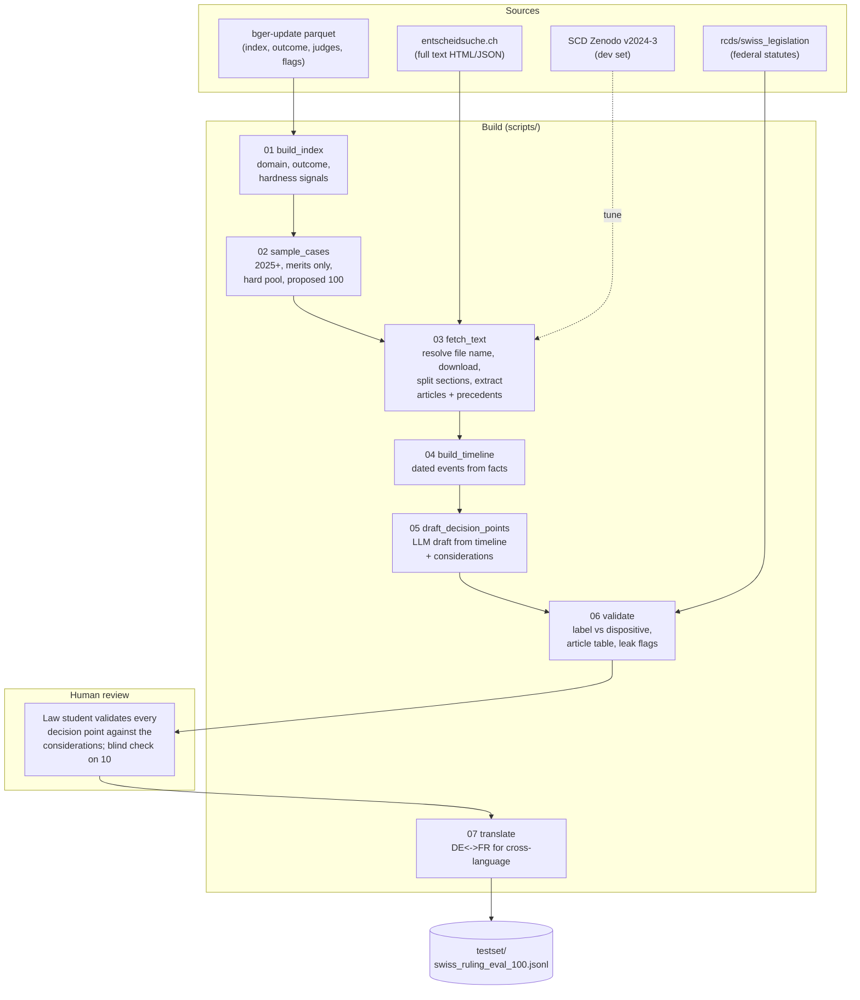
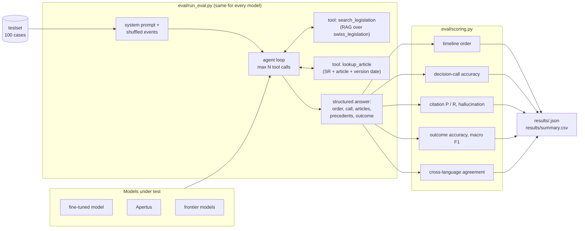

# Swiss Ruling Eval

A hard, 100-case evaluation set built from Swiss Federal Supreme Court decisions on **personal-incident insurance**: illness, accident, disability, daily allowance, pension-fund invalidity and the coordination between them. Plus a harness to compare a fine-tuned legal model against frontier models on the same prompt, the same tools and the same agent loop.

Each case is a timeline of events, presented out of order, with decision points where a party (the insured person, the employer, the insurer) had to make a call. The model rebuilds the timeline, makes each call, and cites the law it relies on. The court's ruling tells us which calls were right. See [docs/case-format-timeline.md](docs/case-format-timeline.md) for the format and a fully worked example.

Trilingual (DE / FR / IT). All source material is CC-BY 4.0 from the Federal Supreme Court.

---

## 1. What the benchmark measures

| Task | Input | Output | Metric |
|---|---|---|---|
| T1 timeline | shuffled events, future hidden | ordered event ids | Kendall tau against the true order, exact-order rate |
| T2 decision call | events up to the decision point, actor, closed options | chosen option, cited articles and precedents, short justification | action accuracy on scored points; citation precision / recall; hallucinated-article rate |
| T3 outcome | full ordered timeline | approval / dismissal, who wins, articles | accuracy and macro F1; citation metrics |
| cross-language | T2 asked in DE and in FR | as T2 | agreement rate on the chosen option |

Ground truth per case: the court's dispositive (outcome), the statutory articles and the leading cases (BGE / ATF / DTF) cited in the considerations, and the court's holding on each decision point. Every metric is reported per domain, per language and per hardness level. Output is one JSON file per model run and one CSV summary across runs.

---

## 2. Data sources

The Bern Legal AI group (`rcds/*` on Hugging Face) published the reference collection, but every dataset in it was frozen in 2023 and stops at **2022**. We use those datasets for tooling only, and three newer sources for the cases.

### Sources used for the cases (decisions from 2025 on)

| Source | What it provides | Coverage | Role |
|---|---|---|---|
| [`jachermann/bger-update`](https://huggingface.co/datasets/jachermann/bger-update) (HF, daily parquet) | Index of every decision published on bger.ch: case number, decision date, language, fine-grained legal area, lower court, subject, **outcome**, judges, publication flag, length. No text. | Jan 2022 to today, ~34K rows | Sampling frame, outcome label, hardness signals |
| [entscheidsuche.ch](https://entscheidsuche.ch/docs/CH_BGer/) | Full text of each decision as HTML + JSON with facts, considerations and dispositive. No bot protection. | All BGer decisions; ~9.7K for 2025 | Case text |
| [Swiss Federal Supreme Court Dataset (SCD)](https://zenodo.org/records/14867950), Geering & Merane, v2024-3 | 31 structured variables per case incl. outcome, cited BGE / BGer, area, parties, plus a full-text parquet. CC-BY 4.0. | 2007 to Dec 2024, 122K cases | Dev set for tuning parsers, regexes and prompts; never in the test set |

bger.ch itself sits behind Incapsula bot protection and returns a challenge page to scripts. We never scrape it directly.

### Sources used for tooling

| Source | Role |
|---|---|
| `rcds/swiss_legislation` | Federal statutes (SR number, abbreviation, full text) to build the valid-article table for hallucination checks and the retrieval corpus for the RAG tool |
| `rcds/swiss_judgment_prediction_xl` | 329K pre-2023 cases with facts, considerations and label. Extra dev data |
| `rcds/swiss_citation_extraction` | Reference only. Its tags are machine-generated and drop the law abbreviation, so it is not used as ground truth |
| `rcds/swiss_leading_decisions` | Landmark BGE cases. Verdict field is mostly empty and the year is a placeholder when the date is missing. Used only to check whether a sampled case became a BGE |

---

## 3. Pipeline





---

## 4. Test set design

### Scope

Personal-incident insurance at the Federal Supreme Court, decisions dated 2025 or later. Domains, from the index's legal-area field, plus private insurance contracts detected from the subject line of civil-chamber cases:

| Key | Domain | Statutes |
|---|---|---|
| IV | disability insurance | IVG / LAI, ATSG / LPGA |
| UV | accident insurance (Suva and private accident insurers) | UVG / LAA |
| KV | mandatory health insurance | KVG / LAMal |
| BVG | occupational pension, invalidity benefits | BVG / LPP |
| AHV_EL | old-age and survivors, supplementary benefits | AHVG / LAVS, ELG / LPC |
| PRIV_VVG | private daily allowance and supplementary health insurance | VVG / LCA |

### Why these cases are hard

A plain "approve or dismiss" on this domain is answerable at about 70 % by always saying "dismiss". Hardness is built into selection and into the task.

Selection signals, all read from the index before any text is fetched:

| Signal | Meaning | Weight |
|---|---|---|
| `sig_panel5` | five-judge panel: the court only sits with five when the question is contested or novel | 2 |
| `sig_publication` | flagged by the court for official publication as a leading decision | 2 |
| `sig_long` | top decile of decision length within the scope | 1 |
| `sig_reversal` | the cantonal court was overturned (approval or partial approval) | 1 |
| `sig_subject` | subject line mentions causality, pension revision, restitution, expert reports, coordination, psychiatric conditions, income comparison, deadlines, or helplessness allowances | 1 |

**Hard pool** = in-scope merits decisions from 2025 on with at least one of `sig_panel5`, `sig_publication`, `sig_long`. Reversals and subject flags raise the score but do not qualify a case on their own.

Task-level hardness comes from the format: shuffled timelines, decision points before litigation where the tempting action is the wrong one, medical expert-report conflicts, causality tests, coordination arithmetic between insurers, and intertemporal law (the IV revision of 2022 and the VVG revision of 2022 mean the applicable article depends on the incident date; an agent that reads the current text of the law gets it wrong).

### Selection rules

| Rule | Value |
|---|---|
| Decision date | 2025-01-01 or later |
| Outcome classes | approval, partial approval, dismissal. Inadmissible and moot decisions excluded |
| Domain quota | IV 30, UV 25, KV 15, BVG 10, AHV_EL 10, PRIV_VVG 10 |
| Language caps | DE 60, FR 40, IT 8 |
| Outcome balance | target half reversals per domain, filled with dismissals where the pool runs out |
| Order | highest hardness score first, then most recent |

Sampling is deterministic. The result of the current snapshot (30 Sep 2026):

| | In scope, merits, 2025+ | Hard pool | Proposed 100 |
|---|---|---|---|
| Cases | 1,027 | 151 | 100 |
| Reversals | 282 | 57 | 48 |
| Five-judge panels | 81 | 81 | 76 |
| Publication-flagged | 49 | 49 | 48 |
| DE / FR / IT | 661 / 332 / 34 | 87 / 57 / 7 | 60 / 35 / 5 |

Both tables are in `testset/candidates_hard_pool.csv` and `testset/proposed_100.csv`, with every signal as a column, so the final 100 can be adjusted by hand.

### Case record

The v2 record (timeline, actors, decision points, outcome, citations) is specified in [docs/case-format-timeline.md](docs/case-format-timeline.md). Fields produced today by `03_fetch_text.py` per case: facts, considerations, dispositive, word counts, cited articles as (law, article, old-version flag, count, procedural flag), cited leading cases and other rulings, and the source URL.

### Validation before a case enters the set

1. **Label cross-check.** The outcome from the index must agree with the dispositive wording. On the proposed 100: 96 agree, 2 are joined cases the regex does not parse, and 2 are **index errors on Italian decisions** (the index says dismissal, the dispositive says partially admitted). Rule: for Italian cases the label is always taken from the dispositive.
2. **Citation gold set.** Articles of the BGG / LTF are admissibility boilerplate and are excluded. Leading cases are part of the gold set: causality rulings often rest on one article and seven precedents.
3. **Leak check, automated.** Facts are searched for phrases that state the Federal Supreme Court's own result.
4. **Leak check, human.** A law student sees only the shuffled events up to each decision point for 10 cases and picks an option. Points that are trivially inferable are dropped.
5. **Decision points.** Every point is validated by the law student against the consideration it rests on; `scored` is set to false where the court did not rule on that call.

---

## 5. Repository layout

```
swiss-evaluation-dataset/
├── README.md
├── requirements.txt
├── docs/
│   └── case-format-timeline.md    # v2 record format and worked example
├── scripts/
│   ├── common.py                  # paths, domain mapping, section split, citation regexes
│   ├── 01_build_index.py          # bger-update -> data/index.parquet (+ hardness signals)
│   ├── 02_sample_cases.py         # hard pool + proposed 100 -> testset/*.csv
│   ├── 03_fetch_text.py           # entscheidsuche.ch -> data/raw/, data/parsed/<case>.json
│   ├── 04_build_timeline.py       # (next) dated events from the facts section
│   ├── 05_draft_decision_points.py# (next) LLM draft, student-validated
│   ├── 06_validate.py             # (next) label, article table, leak flags
│   └── 07_translate.py            # (next) DE <-> FR
├── eval/                          # (day 3) run_eval.py, prompts/, tools/, scoring.py
├── testset/
│   ├── candidates_hard_pool.csv   # 151 candidates with all signals
│   ├── proposed_100.csv           # current proposed selection
│   └── swiss_ruling_eval_100.jsonl# (final) v2 records
├── data/                          # gitignored: snapshots, listing, raw HTML, parsed JSON
└── results/                       # gitignored except summary.csv
```

---

## 6. Plan

| Step | Deliverable | Done when |
|---|---|---|
| done | Index, sampler, fetcher, parser | 100 cases fetched and parsed, 100 % section split, label cross-check run |
| next | Timeline builder, decision-point drafts | every case has a dated event list and 2 to 4 draft decision points with the consideration they rest on |
| next | Validation and human review | law student has validated all points, 10-case blind check done, Italian labels corrected from dispositive |
| then | Harness and baseline | fine-tuned model, Apertus and at least two frontier models run end to end, summary.csv produced, DE / FR cross-language runs |

---

## 7. Setup and run

```bash
uv venv .venv
uv pip install --python .venv/Scripts/python.exe -r requirements.txt

.venv/Scripts/python.exe scripts/01_build_index.py     # downloads the latest bger-update snapshot (34 MB)
.venv/Scripts/python.exe scripts/02_sample_cases.py
.venv/Scripts/python.exe scripts/03_fetch_text.py      # downloads the entscheidsuche listing (~120 MB) once, then 100 decisions
```

`03_fetch_text.py --pool` fetches the whole hard pool instead of the proposed 100. `01_build_index.py --refresh` forces a new snapshot.

---

## 8. Licences and attribution

Court decisions: © Swiss Federal Supreme Court, CC-BY 4.0. SCD: Geering & Merane, CC-BY 4.0, cite via Zenodo DOI 10.5281/zenodo.14867950. `rcds/*` datasets: Rasiah et al. 2023, SCALE, CC-BY-SA 4.0. `jachermann/bger-update`: MIT. The published test set carries CC-BY-SA 4.0 and lists all of the above.
